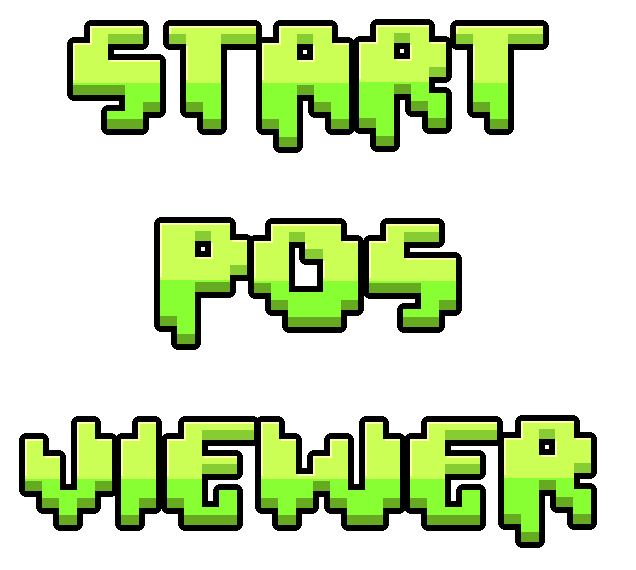

# Start Position Viewer



View, edit, enable/disable, and name all of the start positions in your level from a single panel.

No more scrolling through the editor trying to find the start positions you want to edit!

## Features

- **View all start positions** sorted by their position in the level
- **Enable/Disable** individual start positions or all at once
- **Edit settings** change speed, gamemode, mini, dual, and mirror directly
- **Rename** custom names for every start pos
- **Go To** instantly jump to any start position in the editor

## How to Use

In the editor, press the button located between the **playtest** and **playback** buttons to open the Start Position Viewer panel.

## Build Instructions

```sh
# Assuming you have the Geode CLI set up already
geode build
```
